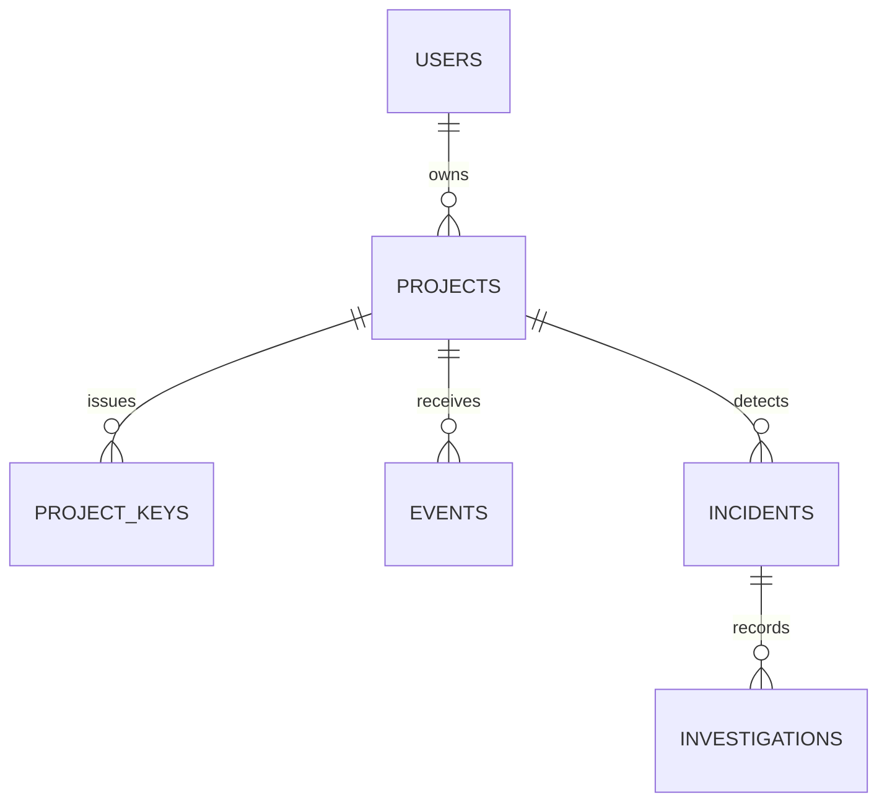

# Database and event model

Use PostgreSQL with Alembic migrations. UUID primary keys; timezone-aware timestamps; foreign keys; unique constraints. Store timestamps in UTC. Column names below are a schema contract; adapt exact SQL types during implementation.

| Table | Core columns | Constraints / notes |
|---|---|---|
| `users` | `id`, `email`, `password_hash`, `created_at` | Unique normalized email; password hash with an established password hasher |
| `projects` | `id`, `owner_id`, `name`, `created_at` | Owner FK; project is the isolation boundary |
| `project_keys` | `id`, `project_id`, `key_prefix`, `key_hash`, `created_at`, `revoked_at` | Never store full plaintext key; unique hash |
| `events` | `id`, `project_id`, `event_id`, `timestamp`, `received_at`, `event_type`, `level`, `service`, `message`, `endpoint`, `status_code`, `latency_ms`, `exception_type`, `stack_trace`, `metadata` JSONB, `fingerprint` | Unique `(project_id,event_id)`; indexed project/time/service; optional fields nullable |
| `incidents` | `id`, `project_id`, `service`, `incident_type`, `status`, `severity`, `started_at`, `last_seen_at`, `resolved_at`, `failure_count`, `request_count`, `detector_version`, `thresholds` JSONB | At most one active row for each project/service/type via partial unique index |
| `investigations` | `id`, `incident_id`, `method`, `summary`, `observations` JSONB, `hypotheses` JSONB, `suggested_checks` JSONB, `limitations` JSONB, `created_at` | Multiple versions possible after refresh; citations contain event IDs |

## Relationships

Add a separate `incident_events` join table only when event membership cannot be reconstructed from a stored time range and grouping; investigations already save citations. Keep raw events for a configurable period (for example, 14 days locally); delete or archive according to project policy. A later pgvector migration can add `embedding` to selected error events with a documented model/version and backfill job. Do not embed every event by default.
