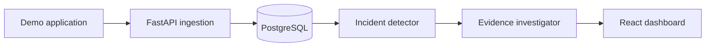

# TraceAI — Plan A project guide

TraceAI is a local-first incident investigation MVP. A monitored backend sends structured events; TraceAI stores and displays them, detects a sustained error spike, groups similar errors, and produces an evidence-linked investigation. The first release uses a deliberately faulty demo service. No customer data or paid API is required.

> Status: build specification, not an implemented product. The examples and thresholds are proposed defaults; benchmark results must be measured.

## Start here

1. Read [BUILD.md](BUILD.md) for the 14-session sequence and acceptance checks.
2. Use [ARCHITECTURE.md](ARCHITECTURE.md) for components and engineering decisions.
3. Implement the contracts in [API.md](API.md) and [DATA_MODEL.md](DATA_MODEL.md).
4. Run the controlled scenarios in [EVALUATION.md](EVALUATION.md).
5. Track deferred work in [ROADMAP.md](ROADMAP.md).

## MVP outcome



The complete demo is: generate healthy traffic; enable one fault; observe an incident; inspect its event groups and timeline; run an investigation; compare its cited evidence with the known injected cause.

## Proposed stack

React + TypeScript + Vite, FastAPI + Pydantic + SQLAlchemy + Alembic, PostgreSQL, Python worker, Docker Compose, pytest, and a demo FastAPI service. Start with keyword and indexed SQL search. Add pgvector and a local embedding model only after exact search works. The investigator first has a deterministic evidence summary; a local OpenAI-compatible model is optional and must never be necessary for detection.

## Local quick start target

After implementing the repository, these commands should work:

```bash
cp .env.example .env
docker compose up --build
```

Expected local URLs: frontend `http://localhost:5173`, API docs `http://localhost:8000/docs`, demo service `http://localhost:8001/docs`. These are targets, not commands that work from this document bundle alone.

## Definition of done

- A user can create a project and see a project key once; only its hash is stored.
- The demo service sends validated request and exception events; filtering and pagination work in the dashboard.
- A reproducible error spike creates one incident per service and fault window; healthy traffic does not create one.
- An investigation cites stored event IDs and separates observations from hypotheses; unsupported causes are labelled uncertain.
- The demo and evaluation scripts reproduce at least three fault scenarios; the README reports actual measured results and limitations.
- Docker Compose starts the full local stack with persisted database data; tests cover the critical ingestion and detection paths.

## Repository target

```text
traceai/
  backend/app/{api,core,db,models,schemas,services,workers}/
  backend/alembic/  backend/tests/
  frontend/src/{pages,components,lib}/
  demo-app/  evaluation/
  docker-compose.yml  .env.example  README.md  docs/
```

These Markdown files can be placed in `docs/` when the code repository is created. Do not commit `.env`, real API keys, source logs with personal data, or generated event dumps.

## Phase 5 demo service (implemented)

Phase 5's separate demo service, fault controls, telemetry behavior, and local setup are documented in [demo-app/README.md](demo-app/README.md). Run it on port 8001 with a dedicated project ingestion key. The Phase 7 detector now runs as a separate worker; see below.

## Phase 6 live event explorer (implemented)

Sign in, open **Events**, and select an owned project. Stored events appear newest received first. Filter by exact service, level, received time in UTC, or text; use Next/Previous to browse pages and Refresh events to load new arrivals. Inspect an event to see its original timestamp, status, latency, stack trace, and metadata. If the project has no events, send telemetry using its ingestion key or the Phase 5 demo first. Overview charts/recent sample events and incidents remain previews.

The read API uses owner session authentication and project-scoped queries. See [API.md](API.md) for filter and pagination semantics. No new migration or dependency is required for Phase 6; restart the existing API to load the routes. Run the backend suite with `.venv/Scripts/python.exe -m pytest tests -q` from `backend` and build the frontend with `npm.cmd run build` from `frontend`.

## Phase 7 detector (implemented)

From `backend`, apply `.venv/Scripts/python.exe -m alembic upgrade head`, then run `.venv/Scripts/python.exe -m app.detector_worker` in a separate terminal. It reads stored request events every 30 seconds and persists incident opening, updates, and recovery across restarts. `--once` performs one cadence-aware check.

Default rules use a five-minute window, at least 20 requests/five failures, and a 10% failure rate across two evaluations; recovery needs two sufficiently busy windows below 5%. Low traffic keeps active incidents open. Configure the documented `DETECTOR_*` settings in the root `.env` and restart the worker when changing them. Full semantics, lifecycle fields, and testing are in [backend/DETECTOR.md](backend/DETECTOR.md).

The existing Incidents screen remains sample data; real incident browsing and exception grouping belong to subsequent phases. Project deletion also removes its incidents and detector state atomically.

## Password recovery (implemented)

Choose **Forgot password?** on Sign in, enter your account email, then use the emailed link to choose and confirm a new password. Links expire after 15 minutes and work once. Resetting revokes all existing login and Google-linking sessions. Google-only accounts continue using Google sign-in. A replacement link invalidates the old link; email requests are limited to one per minute per account, in addition to the authentication attempt limit.

From the backend directory, apply migrations with `.venv/Scripts/python.exe -m alembic upgrade head`, and configure SMTP in the root `.env` before restarting the API. No email credentials or reset links are returned by the API or printed in logs.

For local development without a domain, Gmail SMTP can use these settings:

```dotenv
SMTP_HOST=smtp.gmail.com
SMTP_PORT=587
SMTP_SECURITY=starttls
SMTP_USERNAME=your-address@gmail.com
SMTP_FROM=your-address@gmail.com
SMTP_PASSWORD=your-google-app-password
```

Use a [Google App Password](https://support.google.com/accounts/answer/185833?hl=en), requiring 2-Step Verification, rather than your ordinary Gmail password or OAuth client secret. Some managed/Advanced Protection accounts do not offer App Passwords. SMTP also supports `SMTP_SECURITY=ssl` with port 465. Other providers can use the same settings; [Resend](https://resend.com/docs/send-with-smtp) requires a verified sending domain.

Keep `FRONTEND_URL=http://127.0.0.1:5173` locally and open the link on the computer running Tracely. For deployment, use your HTTPS frontend URL. Reset tokens are in the link fragment so they are not sent in page requests or referrer headers. Missing email setup gives a clear availability error. Delivery failures are logged without account details; requests receive a generic message to avoid revealing whether an email is registered. Background delivery is not a durable queue: if delivery fails or the process stops, request another link after one minute. Live inbox delivery requires configured credentials and a manual check.
